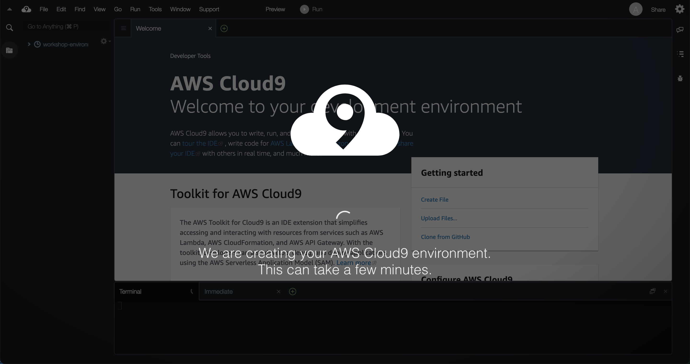
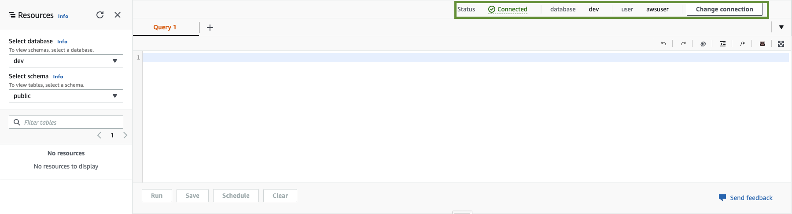

# Log Analysis


## 目錄

- [建立 IAM Role for Redshift](#建立-iam-role-for-redshift)
- [建立 Provisioned Redshift Cluster](#建立-provisioned-redshift-cluster)
- [建立 Cloud9 Environment](#建立-cloud9-environment)
- [AWS 部署](#aws-部署)
- [建立 Redshift Schema 和 Tables](#建立-redshift-schema-和-tables)
- [建立 Redshift Users 並給予權限](#建立-redshift-users-並給予權限)
- [建立 Traffic 任務](#建立-traffic-任務)
- [測試](#測試)
- [Troubleshooting](#troubleshooting)

## 建立 IAM Role for Redshift

Role name: `RedshiftWorkshopRole`

ManagedPolicies

- `AmazonS3FullAccess`
- `AmazonRedshiftAllCommandsFullAccess`


## 建立 Provisioned Redshift Cluster

開啟 Redshift Console 並選擇 Create Cluster


## 建立 Cloud9 Environment




## AWS 部署

### 開啟 Cloud9 終端機


### 確認使用者權限和 AWS 設定

```bash
aws sts get-caller-identity
# {
#     "Account": "xxxxxxxxxxx", 
#     "UserId": "xxxxxxxxxx:xxxxxxx", 
#     "Arn": "arn:aws:sts::xxxxxxxxx:assumed-role/xxxxxxx/xxxxxx"
# }

aws configure list
#       Name                    Value             Type    Location
#       ----                    -----             ----    --------
#    profile                <not set>             None    None
# access_key     ****************G5KD shared-credentials-file    
# secret_key     ****************Ru0s shared-credentials-file    
#     region           ap-northeast-1      config-file    ~/.aws/config
```

### 確認環境

```bash
node --version
# v16.16.0

cdk --version
# 2.3###0 (build b67950d)

docker --version
# Docker version 20.10.13, build a224086

python --version
# Python 3.7.10

pip --version
# pip 20.2.2 from /usr/lib/python3.7/site-packages/pip (python 3.7)

git --version
# git version 2.34.3
```

### Clone Github Repo

```bash
git clone https://github.com/gavinjwl/log-analysis.git
```

### 更新 Python 依賴的函式庫並啟用 Python 虛擬環境 (venv)

```bash
pip install poetry

cd log-analysis

poetry install

source .venv/bin/activate
```

### 部署 AWS 環境

```bash
cdk bootstrap

cdk list
# FortigateOdsStack
# MonitorStack
# PaloaltoOdsStack
# TrafficDwsStack

cdk deploy FortigateOdsStack PaloaltoOdsStack MonitorStack
```

## 建立 Redshift Schema 和 Tables

### 使用 Redshift Query Editor V2 並使用 admin user 連接 Redshift Cluster




### 建立 Schema 和 Tables

```sql
CREATE SCHEMA IF NOT EXISTS network_log;

-- fortigate
CREATE TABLE IF NOT EXISTS network_log.fortigate (
    date_time_raw VARCHAR,
    device_name VARCHAR,
    source_ip VARCHAR,
    source_port VARCHAR,
    destination_ip VARCHAR,
    destination_port VARCHAR,
    action VARCHAR,
    duration VARCHAR,
    sentbyte VARCHAR,
    rcvdbyte VARCHAR
)
DISTSTYLE AUTO
SORTKEY AUTO
ENCODE AUTO
;

-- paloalto
CREATE TABLE IF NOT EXISTS network_log.paloalto (
    future_use_1 VARCHAR,
    receive_time VARCHAR,
    serial_number VARCHAR,
    type VARCHAR,
    threat_content_type VARCHAR,
    future_use_2 VARCHAR,
    generated_time VARCHAR,
    source_address VARCHAR,
    destination_address VARCHAR,
    nat_source_ip VARCHAR,
    nat_destination_ip VARCHAR,
    rule_name VARCHAR,
    source_user VARCHAR,
    destination_user VARCHAR,
    application VARCHAR,
    virtual_system VARCHAR,
    source_zone VARCHAR,
    destination_zone VARCHAR,
    inbound_interface VARCHAR,
    outbound_interface VARCHAR,
    log_action VARCHAR,
    future_use_3 VARCHAR,
    session_id VARCHAR,
    repeat_count VARCHAR,
    source_port VARCHAR,
    destination_port VARCHAR,
    nat_source_port VARCHAR,
    nat_destination_port VARCHAR,
    flags VARCHAR,
    protocol VARCHAR,
    action VARCHAR,
    bytes VARCHAR,
    bytes_sent VARCHAR,
    bytes_received VARCHAR,
    packets VARCHAR,
    start_time VARCHAR,
    elapsed_time VARCHAR,
    category VARCHAR,
    future_use_4 VARCHAR,
    sequence_number VARCHAR,
    action_flags VARCHAR,
    source_location VARCHAR,
    destination_location VARCHAR,
    future_use_5 VARCHAR,
    packets_sent VARCHAR,
    packets_received VARCHAR,
    session_end_reason VARCHAR,
    device_group_hierarchy_level_1 VARCHAR,
    device_group_hierarchy_level_2 VARCHAR,
    device_group_hierarchy_level_3 VARCHAR,
    device_group_hierarchy_level_4 VARCHAR,
    virtual_system_name VARCHAR,
    device_name VARCHAR,
    action_source VARCHAR,
    source_vm_uuid VARCHAR,
    destination_vm_uuid VARCHAR,
    tunnel_id_imsi VARCHAR,
    monitor_tag_imei VARCHAR,
    parent_session_id VARCHAR,
    parent_start_time VARCHAR,
    tunnel_type VARCHAR,
    sctp_association_id VARCHAR,
    sctp_chunks VARCHAR,
    sctp_chunks_sent VARCHAR,
    sctp_chunks_received VARCHAR,
    rule_uuid VARCHAR,
    http_2_connection VARCHAR,
    app_flap_count VARCHAR,
    policy_id VARCHAR,
    link_switches VARCHAR,
    sd_wan_cluster VARCHAR,
    sd_wan_device_type VARCHAR,
    sd_wan_cluster_type VARCHAR,
    sd_wan_site VARCHAR,
    dynamic_user_group_name VARCHAR
)
DISTSTYLE AUTO
SORTKEY AUTO
ENCODE AUTO
;

-- event_monitor
CREATE TABLE IF NOT EXISTS network_log.event_monitor (
    event_time TIMESTAMPTZ,
    principal VARCHAR,
    statement_name VARCHAR,
    statement_id VARCHAR,
    state VARCHAR
)
DISTSTYLE AUTO
SORTKEY AUTO
ENCODE AUTO
;
```

## 建立 Redshift Users 並給予權限


```sql
-- Grant Fortigate
CREATE USER "<role-name-from-cfn-output>" PASSWORD DISABLE;
GRANT ALL ON SCHEMA network_log TO "<role-name-from-cfn-output>";
GRANT ALL ON TABLE network_log.fortigate TO "<role-name-from-cfn-output>";

-- Grant Paloalto
CREATE USER "<role-name-from-cfn-output>" PASSWORD DISABLE;
GRANT ALL ON SCHEMA network_log TO "<role-name-from-cfn-output>";
GRANT ALL ON TABLE network_log.paloalto TO "<role-name-from-cfn-output>";

-- Grant Monitor
CREATE USER "<role-name-from-cfn-output>" PASSWORD DISABLE;
GRANT ALL ON SCHEMA network_log TO "<role-name-from-cfn-output>";
GRANT ALL ON TABLE network_log.event_monitor TO "<role-name-from-cfn-output>";
```

## 建立 Traffic 任務

### 使用 Cloud9 編輯設定檔

設定檔: `log_analysis/traffic_lambda/config.py`

```python
DEPENDENCIES = {
    '<function-name-from-cfn-output>': 'fortigate',
    '<function-name-from-cfn-output>': 'paloalto',
}
```

### 使用 Cloud9 部署 Traffic Stack

```bash
cdk deploy TrafficDwsStack
```

### 使用 Redshift 建立 Traffic user

```sql
-- Grant Traffic permission
CREATE USER "<role-name-from-cfn-output>" PASSWORD DISABLE;
GRANT ALL ON SCHEMA network_log TO "<role-name-from-cfn-output>";
GRANT SELECT ON TABLE network_log.fortigate TO "<role-name-from-cfn-output>";
GRANT SELECT ON TABLE network_log.paloalto TO "<role-name-from-cfn-output>";
```

## 測試

### 上傳資料

```bash
aws s3 cp Paloalto_sample.txt s3://<bucket-name-from-cfn-output>/raw/
aws s3 cp Fortigate_sample_dq.txt s3://<bucket-name-from-cfn-output>/raw/
aws s3 cp Fortigate_sample_ndq.txt s3://<bucket-name-from-cfn-output>/raw/
aws s3 cp Fortigate_sample_V4.txt s3://<bucket-name-from-cfn-output>/raw/
```

### 觀看結果

```sql
SELECT * FROM network_log.traffic;
SELECT COUNT(*) FROM network_log.traffic;
```

### 觀看執行紀錄

```sql
SELECT * 
FROM network_log.event_monitor
ORDER BY event_time DESC;
```

## Troubleshooting

### 檢查 STL_ERROR

```sql
SELECT pg_user.usename, process, pid, context, errcode, error, recordtime
FROM STL_ERROR, pg_user
WHERE STL_ERROR.userid = pg_user.usesysid
ORDER BY recordtime DESC
;
```

### 檢查 Redshift User 權限

```sql
-- Get user list
SELECT * FROM pg_user;

-- Schema level
SELECT
    u.usename,
    s.schemaname,
    has_schema_privilege(u.usename,s.schemaname,'create') AS user_has_select_permission,
    has_schema_privilege(u.usename,s.schemaname,'usage') AS user_has_usage_permission
FROM
    pg_user u
CROSS JOIN
    (SELECT DISTINCT schemaname FROM pg_tables) s
WHERE
    u.usename = 'myUserName' AND s.schemaname = 'mySchemaName'
;


-- Table level
SELECT
    u.usename,
    t.schemaname||'.'||t.tablename,
    has_table_privilege(u.usename,t.tablename,'select') AS user_has_select_permission,
    has_table_privilege(u.usename,t.tablename,'insert') AS user_has_insert_permission,
    has_table_privilege(u.usename,t.tablename,'update') AS user_has_update_permission,
    has_table_privilege(u.usename,t.tablename,'delete') AS user_has_delete_permission,
    has_table_privilege(u.usename,t.tablename,'references') AS user_has_references_permission
FROM
    pg_user u
CROSS JOIN
    pg_tables t
WHERE
    u.usename = 'myUserName' AND t.tablename = 'myTableName'
;
```

### 測試 Redshift User 權限

```sql
SET SESSION AUTHORIZATION '';
-- Do something
SET SESSION AUTHORIZATION default;
```
